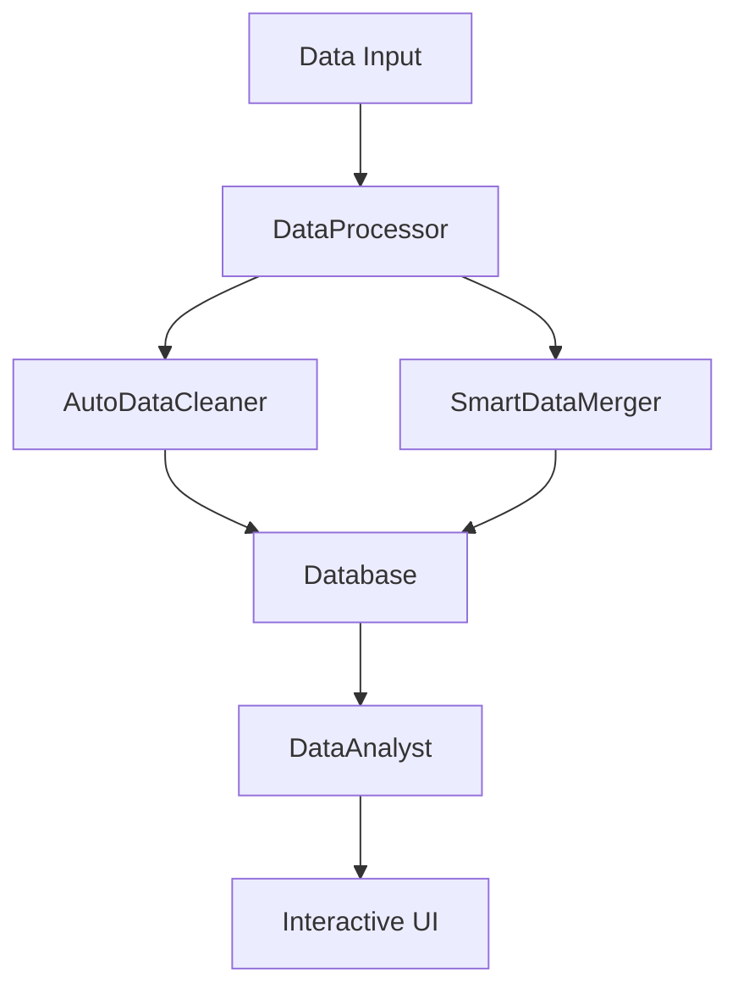

# Intelligent Data Analysis System
> A streamlined data analysis system leveraging AI for automated data cleaning and natural language business insights.

## 🎯 Overview
Transform your data analysis workflow with our AI-powered system that automates data cleaning, performs intelligent analysis, and provides business insights through natural language queries. Built for simplicity and efficiency.

## 🌟 Key Features

### 🤖 AI-Powered Data Processing
* **Automated Data Cleaning**
  - Pattern recognition for inconsistencies
  - Smart missing value handling
  - Data type standardization
  - Duplicate detection and resolution

* **Intelligent Schema Analysis**
  - Automated column name standardization
  - Smart relationship detection between datasets
  - Business-friendly naming conventions

* **Advanced Data Merging**
  - AI-driven merge strategy detection
  - Automated key identification
  - Fuzzy matching capabilities

### 💡 Smart Analysis Features
* Natural language query processing
* Fuzzy matching for flexible searches
* Multi-agent analysis system:
  - Data Cleaning Agent
  - Schema Analyst Agent
  - Business Intelligence Agent

### 🎮 User Interface
* Interactive web interface
* Real-time analysis
* Export capabilities

## 🚀 Getting Started

### Prerequisites
```bash
python >= 3.10
poetry
OpenAI API key
```

### Quick Start
```bash
# Install the package
poetry install

# Set up environment
cp .env.example .env
# Add your OpenAI API key to .env

#Initialize the db and cleaning CSV
poetry run flight_analysis/main.py

# Launch interactive interface
poetry run streamlit run flight_analysis/interactive.py
```

## 🏗️ Architecture

### Component Overview


### Key Components

1. **DataProcessor**
   - Data ingestion and validation
   - Processing coordination
   - Batch handling

2. **AutoDataCleaner**
   ```python
   class AutoDataCleaner:
       """
       AI-powered data cleaning with pattern recognition
       and automated standardization
       """
       def clean_dataset(self, df):
           # Intelligent cleaning logic
           return cleaned_df
   ```

3. **DataAnalyst**
   ```python
   class DataAnalyst:
       """
       Natural language analysis interface
       """
       def analyze(self, question: str) -> Dict[str, Any]:
           # Analysis logic
           return results
   ```

## 🧪 Quality Assurance

### Testing
```bash
# Run test suite
pytest

# Run specific test category
pytest tests/test_cleaning.py -v
```

### Code Quality
- Type hints throughout
- Comprehensive documentation
- PEP 8 compliant
- Extensive logging

## ⚙️ Configuration

### Basic Setup
```python
# config.py
OPENAI_MODEL = "gpt-4"
BATCH_SIZE = 1000
LOG_LEVEL = "INFO"
```

## 🔄 Data Pipeline

### 1. Data Ingestion
- Multiple format support (CSV, Excel, SQL)
- Validation checks

### 2. Cleaning
- Automated consistency checks
- Missing value handling
- Outlier detection

### 3. Analysis
- Schema optimization
- Query processing
- Result formatting

